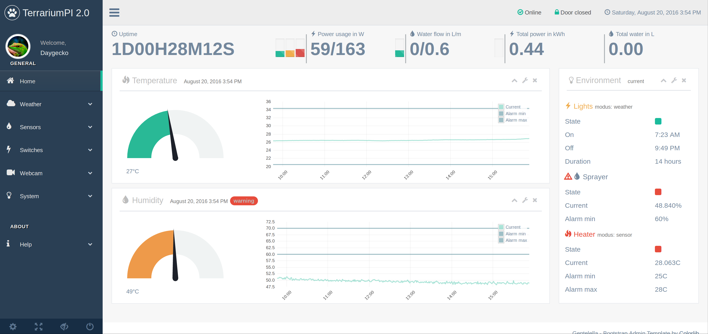
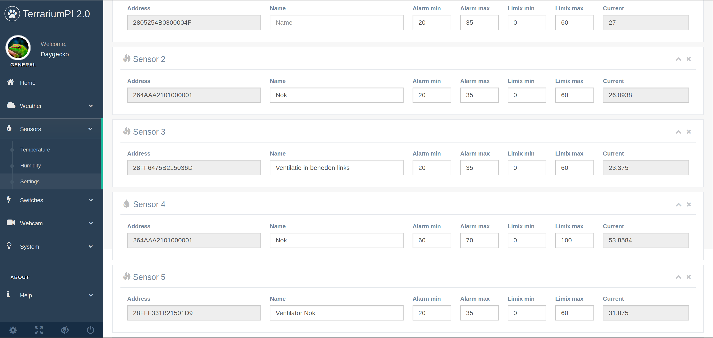
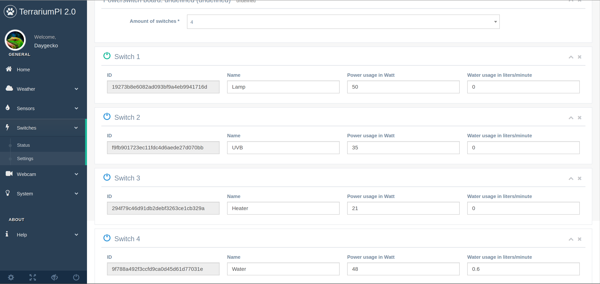
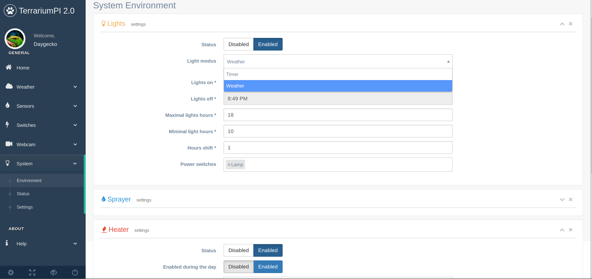

# TerrariumPI 2.0
Software for cheap home automation of your reptile terrarium or any other enclosed environment. With this software you are able to control an enclosed environment so that the temperature and humidity is of a constant value. Think off:
- Terrarium
- Aquarium
- Growhouse

And all this is controlled with a nice webinterface based on [Bootstrap 3 template](https://github.com/puikinsh/gentelella/).
## Features
- Controlling electronic devices like lights, sprayers, heating and cooling equipment
- Reading out temperature and humidity sensors
- Open door detection (sprayer will not spray when door(s) are open)
- Support for native Raspberry PI cam out of the box
- Power and water usage for costs calculation
- Lights control based on sun rise and sun set or timers
- Rain control based on measured humidity
- Heater control based on temperature sensors
- Cooling control based on temperature sensors
- Weather forecast from external source

# Installation
1. Get a working Raspberry PI
2. Clone this repository and submodules: git clone --recursive https://github.com/theyosh/TerrariumPI.git
3. run ./install.sh in the cloned folder
4. reboot Raspberry PI to get all the needed modules loaded
5. Go to the webinterface at http://[raspberry_ip]:8090

If you want to use the Raspberry PI 1 wire interface, you have to manually enable it through the raspi-config and reboot once more.

# Hardware
This software requires some extra hardware in order to run and work. The bare minimun is
- Power relay board
  - USB versions (Serial and Bitbang)
  - GPIO versions
- Temperature/humdity sensors DHT11, DHT22, AM2303, DS1820, HIH4000, etc through
  - OWFS
  - GPIO
  - 1 Wire interface

All other hardware depends on the usage. But you can use lights, spray systems, fans, everything that can be switched on and off through the USB power relay board.

# Screenshots
## Dashboard

## Sensors

## Power switches

## Environment

# About
Read more information at: https://terrarium.theyosh.nl/index.html
