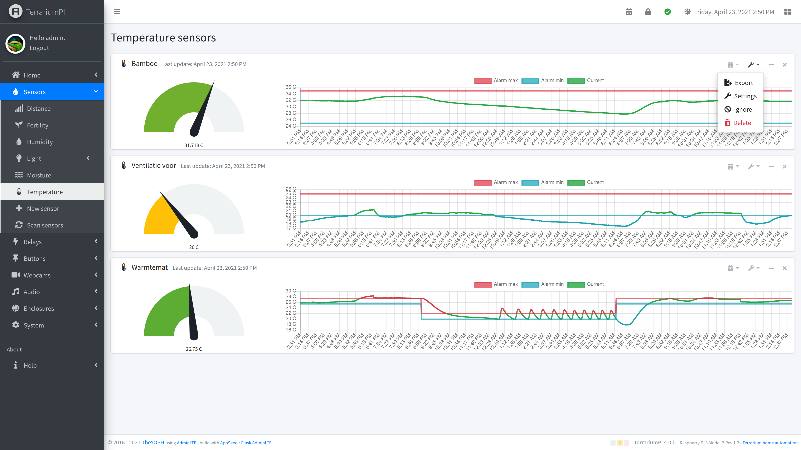
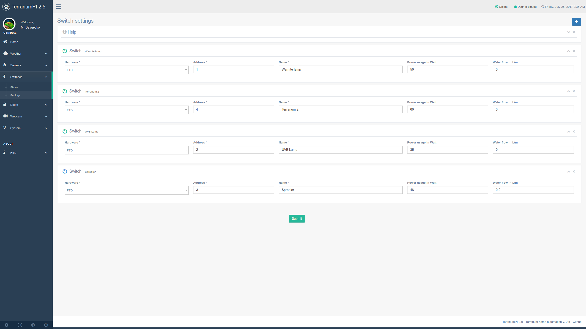
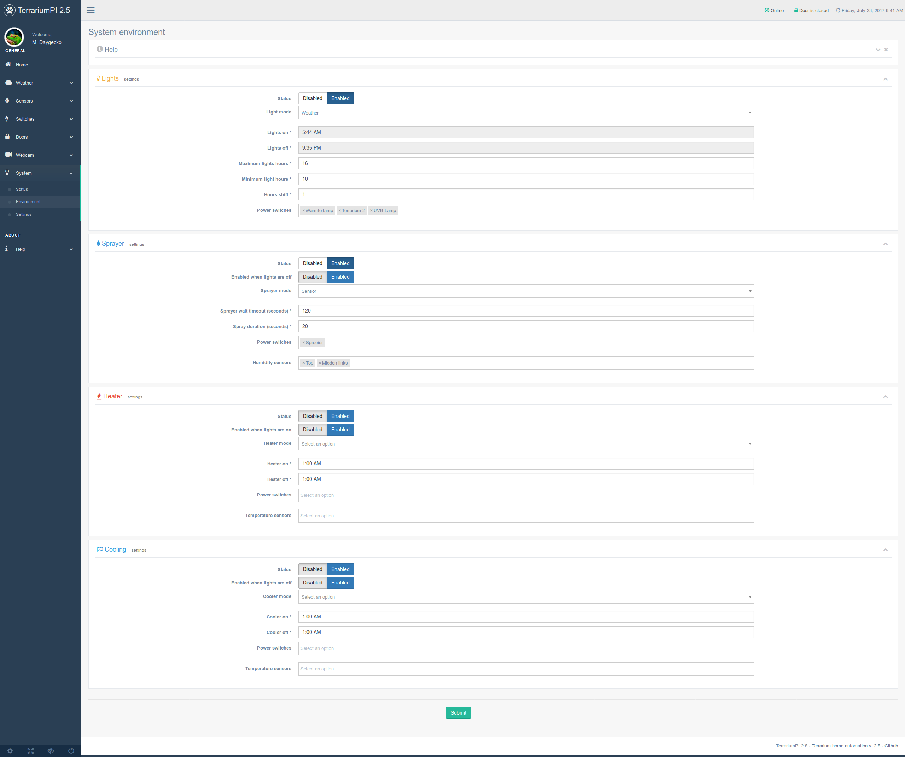
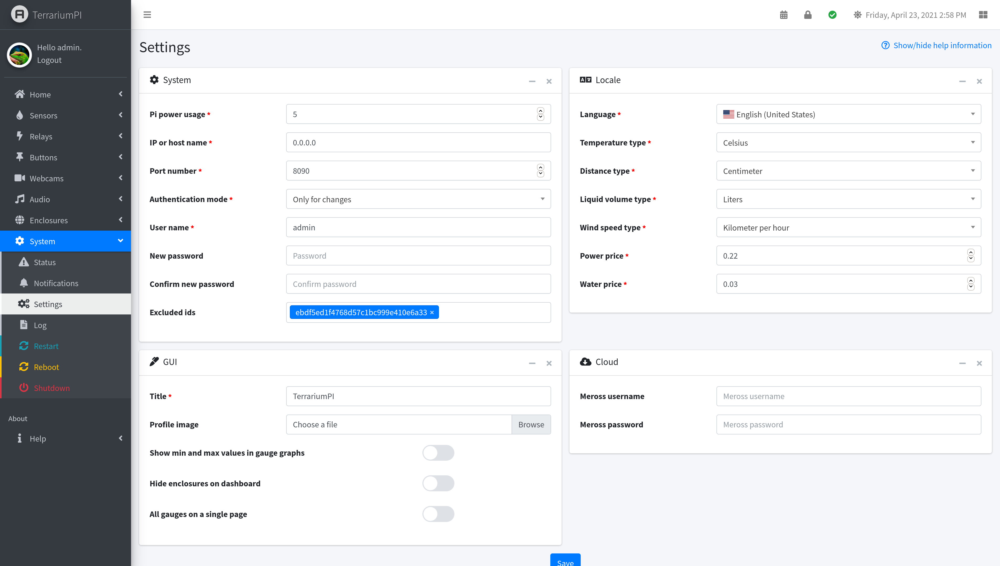

# TerrariumPI 2.8.2
Software for cheap home automation of your reptile terrarium or any other enclosed environment. With this software you are able to control for example a terrarium so that the temperature and humidity is of a constant value. Controlling the temperature can be done with heat lights, external heating or cooling system. As long as there is one temperature sensor available the software is able to keep a constant temperature.

For humidity control there is support for a spraying system. The sprayer can be configured to spray for an X amount of seconds and there is a minumal period between two spray actions. Use at least one humitidy sensors to get a constant humidity value.

The software is that flexible that there is no limit in amount of sensors, relay boards or door sensors. The usage can be endless.

Think off:
- Terrarium (wet of dry)
- Aquarium
- Tanks with animals or plants
- Growhouse

And all this is controlled with a nice webinterface based on [Gentelella a Bootstrap 3 template](https://github.com/puikinsh/gentelella/).
## Features
- Controlling electronic devices like lights, sprayers, heating and cooling equipment
- Support for dimming electronic devices
  - Manual dimming through web interface
  - Predefined on and off durations
  - Predefined on and off dimming percentages
- Reading out multiple temperature and humidity sensors
- Support for native Raspberry Pi cam out of the box
- Support for USB and remote webcams
- Open door detection (sprayer will not spray when a door is open)
- Total power and water usage for costs calculation
- Lights control based on sun rise and sun set or timers
- Rain control based on humidity sensors and timers
- Heater control based on temperature sensors or timers
- Cooling control based on temperature sensors or timers
- Weather forecast from external source for lighting schema
- Temperatures in Celsius or Fahrenheit
- Alarm detections

It is currently controling my reptile terrarium for more then three years! And my Madagascar Day Gecko is very happy with it!

## Translations
The software has support for the following languages:
- English
- Dutch
- German
- Italian

Your language not in the list? [Create your own language translation](https://github.com/theyosh/TerrariumPI/wiki/Translations)

## Installation
The installation expects a Pi with working network and ssh. It is tested with [Raspbian Stretch Lite](https://www.raspberrypi.org/downloads/raspbian/). For now the Full version is not working somehow.... So use the lite image!
1. Get a working Raspberry Pi and login as user 'pi'
  `ssh pi@[raspberry_ip]`
2. Clone this repository and submodules!
  `git clone --recursive https://github.com/theyosh/TerrariumPI.git`
3. Enter the new TerrariumPI folder
  `cd TerrariumPI`
4. Run the installer script and wait
  `sudo ./install.sh`
5. Reboot Raspberry PI to get all the needed modules loaded
  `sudo reboot`
6. Go to the webinterface at http://[raspberry_ip]:8090

If you want to use the Raspberry PI 1 wire interface, you have to manually enable it through the raspi-config and reboot once more.

Make sure that your Pi is secured when you put it to the Internet. Would be a shame if TerrariumPI gets next fictum of '[A smart fish tank left a casino vulnerable to hackers](http://money.cnn.com/2017/07/19/technology/fish-tank-hack-darktrace/index.html)' :P

## Updating
This updating is based on that the software is installed with the steps in the Installation above.
1. Get a working Raspberry Pi and login as user 'pi'
  `ssh pi@[raspberry_ip]`
2. Enter the TerrariumPI folder
  `cd TerrariumPI`
3. Update the new code with git
  `git pull`
4. Re-run the installation script in order to update software dependencies
  `sudo ./install.sh`
4. Restart TerrariumPI according to: https://github.com/theyosh/TerrariumPI/wiki/FAQ#how-to-restart-terrariumpi

Now clear your browser cache and reload the webinterface. A brand new version should be running.

## Hardware
This software requires a Raspberry Pi and some extra hardware in order to run and work. The bare minimun and tested hardware is
- Raspberry PI
  - Pi 2
  - Pi 3
- Power relay board
  - USB versions (Serial and Bitbang)
  - GPIO versions
  - PWM Dimmer versions
- Temperature/humdity sensors DHT11, DHT22, AM2303, DS1820, HIH4000, etc through
  - OWFS
  - GPIO
  - 1 Wire interface

If there is some other hardware which is not working with TerrariumPI, open an issue on [Github](https://github.com/theyosh/TerrariumPI/issues) and we will try to support it. Raspberry Pi Zero is not tested.

## Screenshots
(made on a very big screen :P )
### Dashboard

### Sensors

### Adding sensors

### Power switches

### Environment setup

### System settings

More screenshots can be found [here](https://github.com/theyosh/TerrariumPI/tree/master/screenshots)

## About
A live version is running at: https://terrarium.theyosh.nl/index.html. Go to 'Help' menu for more information about used hardware, software and how to setup.
