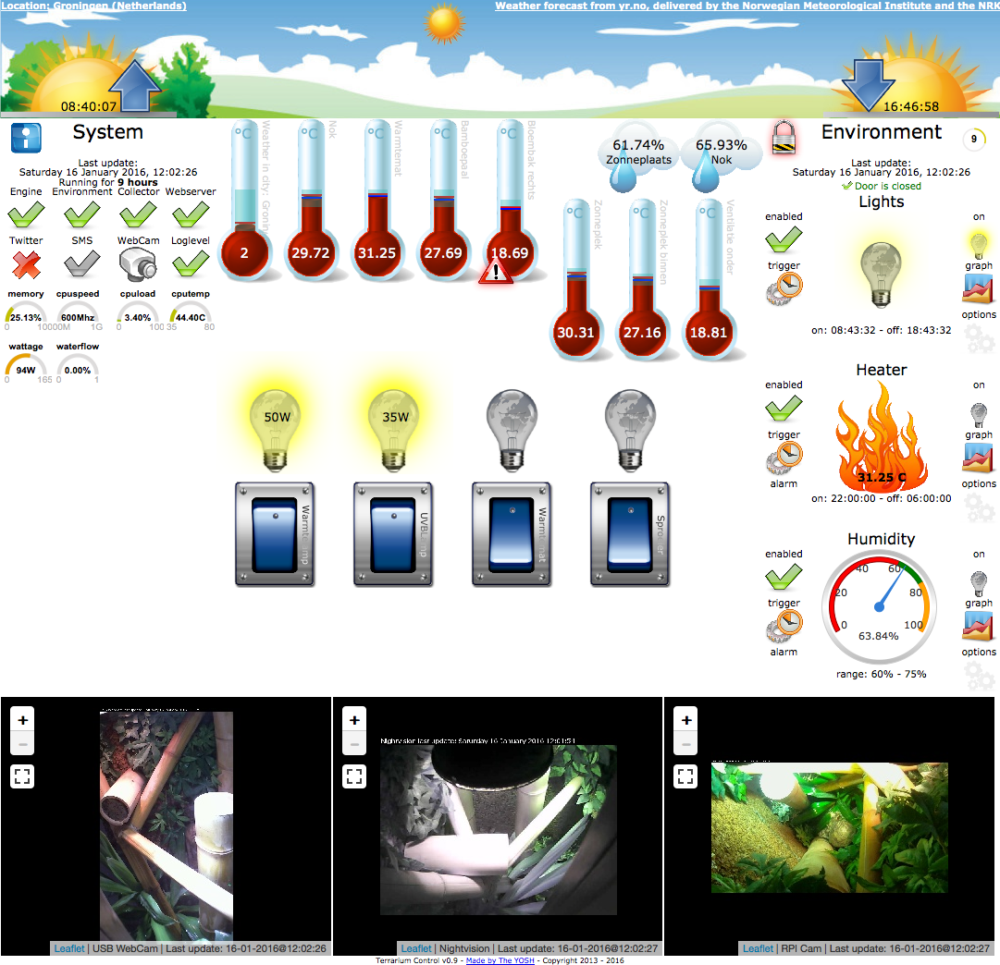

# TerrariumPI
Home automated terrarium for reptiles. This software package is able to control a closed environment for animals or plants.

# Installation
1. Get a working Raspberry PI
2. Clone this repository
3. run ./install.sh in the cloned folder
4. Go to the webinterface at http://127.0.0.1:8282

# Screenshot

# About
Read more information at: https://terrarium.theyosh.nl/index.html
