# TerrariumPI 4.6.1

Software for cheap home automation of your reptile terrarium or any other enclosed environment. With this software you are able to control for example a terrarium so that the temperature and humidity is of a constant value. Controlling the temperature can be done with heat lights, external heating or cooling system. As long as there is one temperature sensor available the software is able to keep a constant temperature.

For humidity control there is support for a spraying system. The sprayer can be configured to spray for an X amount of seconds and there is a minimal period between two spray actions. Use at least one humidity sensors to get a constant humidity value. In order to lower the humidity you can add a dehumidifier.

The software is that flexible that there is no limit in amount of sensors, relay boards or door sensors. The usage can be endless. All power switches have support for timers to trigger based on a time pattern.

If you are using this software for your animals or plants, **[please post some pictures](https://github.com/theyosh/TerrariumPI/issues/210)**

**Full documentation** can be found at [https://theyosh.github.io/TerrariumPI/](https://theyosh.github.io/TerrariumPI/)

**Contact** https://matrix.to/#/#terrariumpi:theyosh.nl

Think off:

- Terrarium (wet or dry)
- Aquarium
- Tanks with animals or plants
- Greenhouse

And all this is controlled with a nice web interface with [AdminLTE 3](https://adminlte.io/) based on Bootstrap 4 made interactive with [Svelte](https://svelte.dev/).

## Table of Contents

1. [Features](#features)
2. [Translations](#translations)
3. [Installation](#installation)
4. [Updating](#updating)
5. [Hardware](#hardware)
   1. [GPIO numbering](#gpio-numbering)
   2. [New hardware](#new-hardware)
6. [Remote data](#remote-data)
7. [Contributors](#contributors)
8. [Screenshots](#screenshots)
9. [Testing](#testing)
10. [About](#about)

## Features

- Controlling electronic devices like lights, sprayers, heating, cooling, water pump equipment etc
- Support for dimming electronic devices
  - Manual dimming through web interface
  - Predefined on and off dimming durations
  - Predefined on and off dimming percentages
  - Predefined dimming steps for environment system (heater and cooler)
- Support for timers in power switches and environment [#72](https://github.com/theyosh/TerrariumPI/issues/72)
  - Predefined start and stop times based on timer or weather
  - Predefined on and off durations in minutes
- Support for Energenie USB, LAN and RF power switches [EG-PM(s)2](http://energenie.com/item.aspx?id=7556)
- Support for WeMo Wifi power switches
- Support for [Meross MSS425E Power Switches](https://www.meross.com/product/16/article/) (Requires Python 3 setup)
- Support for Sonoff remote power devices
  - [Tasmota](https://github.com/arendst/Sonoff-Tasmota)
- Support for [multiple type of sensors](https://github.com/theyosh/TerrariumPI/wiki/Hardware#sensors)
  - Temperature
  - Humidity
  - Moisture
  - Conductivity
  - Distance
  - pH
  - Light intensity
  - UV A and B
  - Fertility
  - Volume
- Support for webcams and native Raspberry Pi cam out of the box
  - Raspberry Pi cam can be streamed live with 6 seconds delay
  - Archiving images based on motion or time interval
- Support for analog devices through a MCP3008
  - Support for PH probe SKU SEN0161
- Support for MiFlora Bluetooth sensors
- Open door detection. This can be used in different environment parts
- Total power and water usage for costs calculation
- Lights control based on sun rise and sun set or timers
- Rain control based on humidity sensors and timers
- Temperature control based on temperature sensors or timers
  - Variable day and night difference for min and max temperature
- Water tank level control based on ultrasonic sound range sensors or volume sensors
- Weather forecast from external source for lighting schema
  - Supports <https://openweathermap.org>
- Temperatures in Celsius or Fahrenheit
- Distances in centimeters or inches
- Alarm detections
- Audio support through internal audio jack or USB sound cards [#42](https://github.com/theyosh/TerrariumPI/issues/42)
  - Create playlists (loop and repeat)
  - Volume control in the web interface
  - Uploading audio files through web interface
  - Audio meta data support (mediainfo)
- Remote temperature and humidity sensors through HTTP(S) JSON API's. JSON Data format can be found on [Remote data wiki](https://github.com/theyosh/TerrariumPI/wiki/Remote-data).
- Display support
  - LCD 16x2 or 20x4 screens either through I2C or [Serial](https://www.instructables.com/id/Raspberry-Pi-Arduino-LCD-Screen/)
  - OLED based on SSD1306
- Calendar system when hardware is replacement and when new hardware needs to be installed
- Notifications system. Custom messages for custom actions with use of variables in the messages
  - Get notifications through
    - Email
    - Display
    - Webhooks
  - Notifications for
    - Environment part low and high alarm
    - Sensor high and low measurements
    - Power switch toggle on and off
    - Open and close doors
    - System error and warning messages

It is currently controling my reptile terrarium since **2015**! And my Madagascar Day Gecko is very happy with it!

## Translations

The software has support for the following languages:

Your language not in the list or not up to date? [Create your own language translation](https://github.com/theyosh/TerrariumPI/wiki/Translations)

## Installation

### Base

The installation expects a Pi with working network and ssh. It is tested with [Raspberry Pi OS Lite](https://www.raspberrypi.org/software/operating-systems/). For now the Desktop/Full version is not working somehow.... So use the lite image!
It is possible to use USB or SSD drives to speed things up: <https://www.tomshardware.com/how-to/boot-raspberry-pi-4-usb>

### Docker

There is a Docker image which can be used instead of the source code. This should make the installation a bit more easier. More information can be found at: [https://theyosh.github.io/TerrariumPI/install/#docker](https://theyosh.github.io/TerrariumPI/install/#docker)

You can skip the manual installation part.

### Manual

1. Get a working Raspberry Pi and login as user 'pi' \
   `ssh pi@[raspberry_ip]`
2. Install git \
   `sudo apt -y install git`
3. Clone this repository and submodules! \
   `git clone --depth 1 https://github.com/theyosh/TerrariumPI.git`
4. Enter the new TerrariumPI folder \
   `cd TerrariumPI`
5. Run the installer script and wait \
   `sudo ./install.sh`
6. Reboot Raspberry PI to get all the needed modules loaded \
   `sudo reboot` (if done manual)
7. Go to the web interface at <http://[raspberry_ip>]:8090 (login: **admin/password**)

All needed options and modules are setup by the installer script. This means that I2C and 1Wire overlay are enabled by default.

Make sure that your Pi is secured when you put it to the Internet. Would be a shame if TerrariumPI gets next victim of '[A smart fish tank left a casino vulnerable to hackers](http://money.cnn.com/2017/07/19/technology/fish-tank-hack-darktrace/index.html)' :P

## Updating

This updating is based on that the software is installed with the steps in the Installation above. When updating between release versions it will take more time due to database updates and cleanups. This can be seen in the log file.

### Docker

Stop the running container and pull the new image. Then you can start the container again.

### Manual

1. Get a working Raspberry Pi and login as user 'pi' \
   `ssh pi@[raspberry_ip]`
2. Enter the TerrariumPI folder \
   `cd TerrariumPI`
3. Update the new code with git \
   `git pull`
4. Re-run the installation script in order to update software dependencies \
   `sudo ./install.sh`
5. Restart TerrariumPI: `sudo service terrariumpi restart`

Now **clear your browser cache** and reload the web interface. A brand new version should be running.

## Hardware

This software requires a Raspberry Pi and some extra hardware in order to run and work. The bare minimum and tested hardware is

- Raspberry PI with at least **4GB SD card** running [Raspberry Pi OS Lite](https://www.raspberrypi.org/software/operating-systems/).
  - Pi 2 (At own risk/no support)
  - Pi 3 (At own risk/limited support)
  - Zero (At own risk/no support)
  - Pi 4
- Power relay board
  - USB versions (Serial and Bitbang)
  - GPIO versions
  - PWM Dimmer versions
- Temperature/humidity/ultrasonic/PH sensors DHT11, DHT22, AM2303, DS1820, HIH4000, HC-SR04, SEN0161, etc through
  - OWFS
  - GPIO
  - 1 Wire interface
  - MCP3008 ([RasPiO Analog Zero](https://github.com/raspitv/analogzero))

[Full list of supported hardware](https://theyosh.github.io/TerrariumPI/hardware/)

### GPIO numbering

All hardware that connects to the GPIO pins use **Physical GPIO numbering** (1 - 40). The software will translate it to BCM if needed for a supported device or sensor. [More information about GPIO pin numbering](https://pinout.xyz/)

For the analog devices use numbers of the channel on the analog device which is from 0 to 7 (8 channels). Also the software expect the analog MCP3008 on GPIO ports 19,21,23,24 physical (default). [More information about GPIO pin numbering](https://pinout.xyz/)

### New hardware

If there is some other hardware which is not working with TerrariumPI, open an issue on [Github](https://github.com/theyosh/TerrariumPI/issues) and we will try to support it. We can only test it on a Raspberry PI 4.

## Remote data

It is possible to use external sensor data that is available through HTTP(S) in JSON format. This way you can combine multiple Raspberry Pi's with TerrariumPI running to one single system. By using multiple Raspberry PI's you can cover a bigger area. But there are limitations.

Currently it is READONLY. So you can read out remote sensors and switches but you cannot control the remote switches. But this way you can combine the power switches total costs and power usage.

more information is here: [Remote data wiki](https://github.com/theyosh/TerrariumPI/wiki/Remote-data)

## Contributors

## Screenshots

(made on a very big screen :P )

### Dashboard

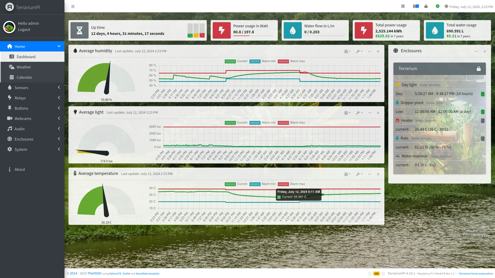

### Sensors

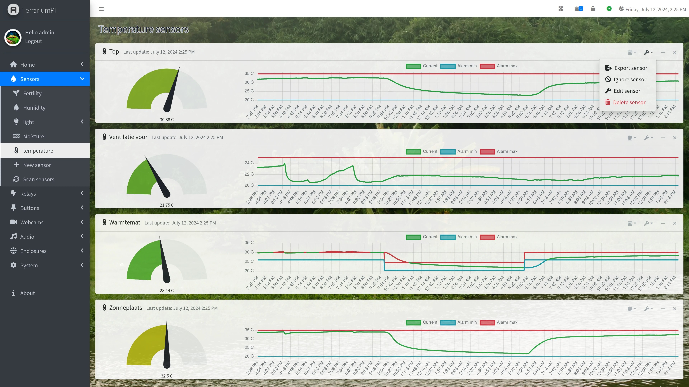
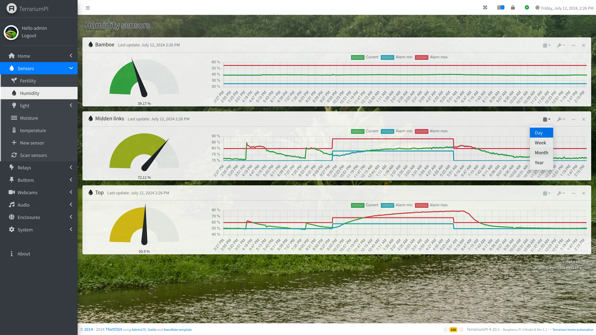
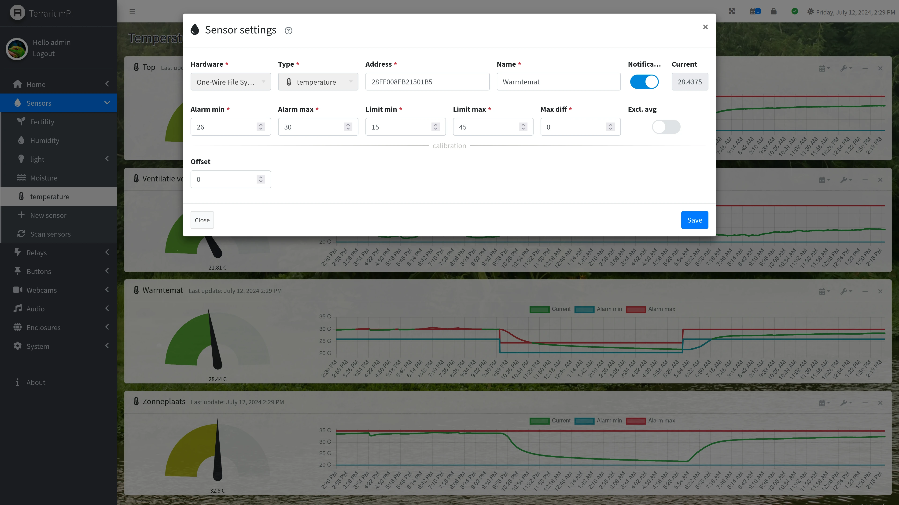

### Relays

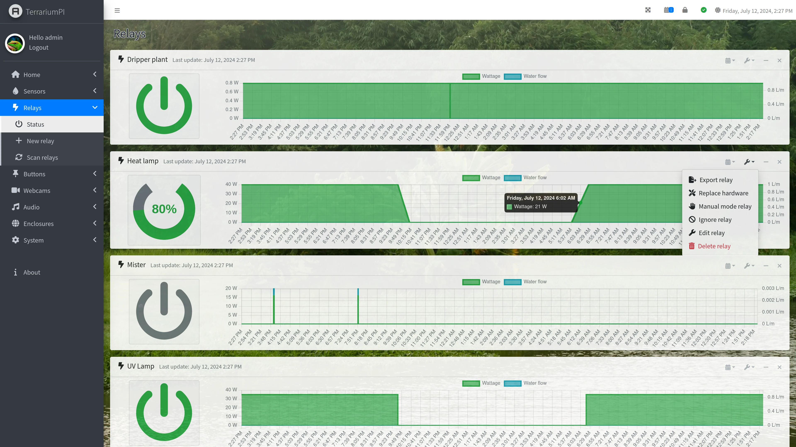
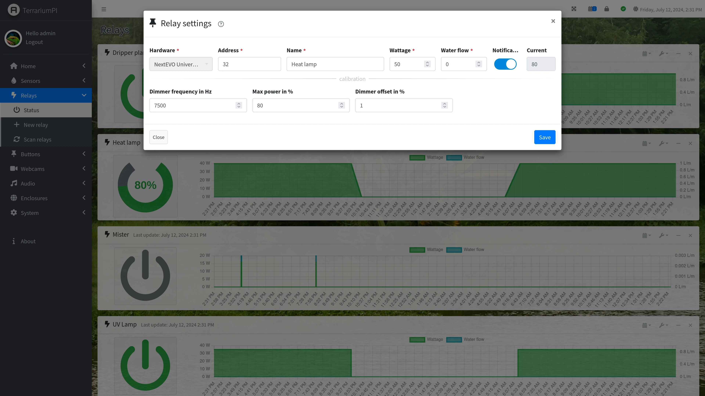

### Enclosure setup

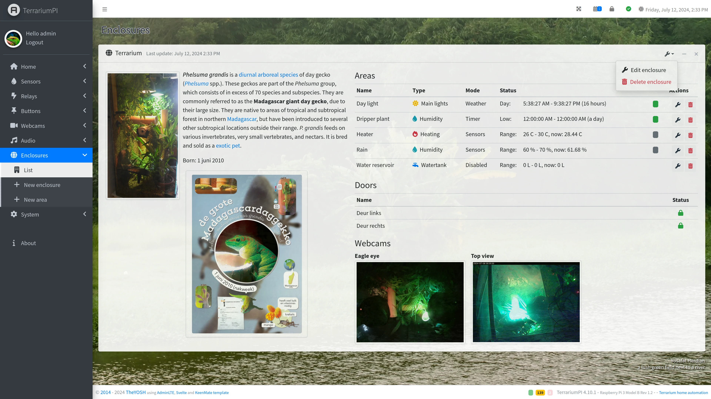
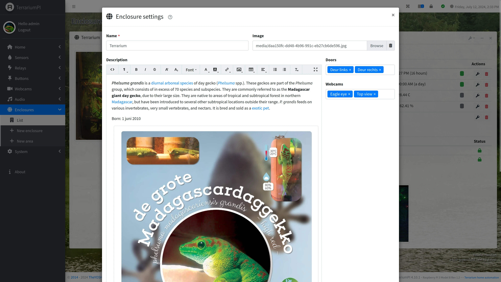

### Area setup

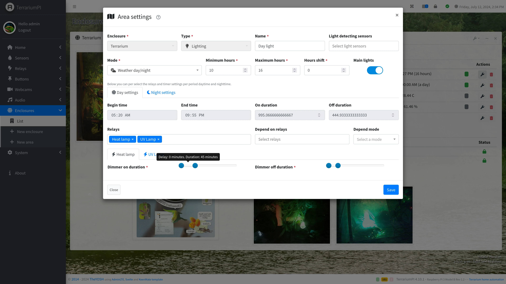
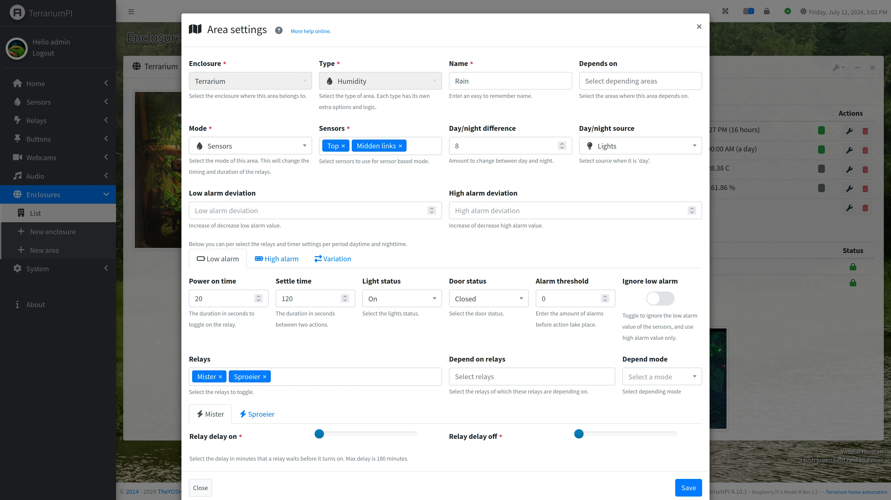

### System settings

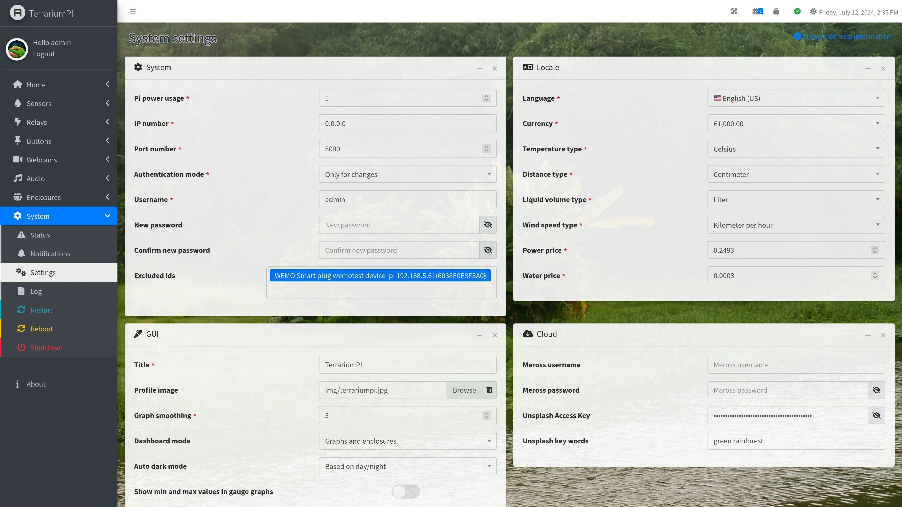

### MOTD (Message Of The Day)

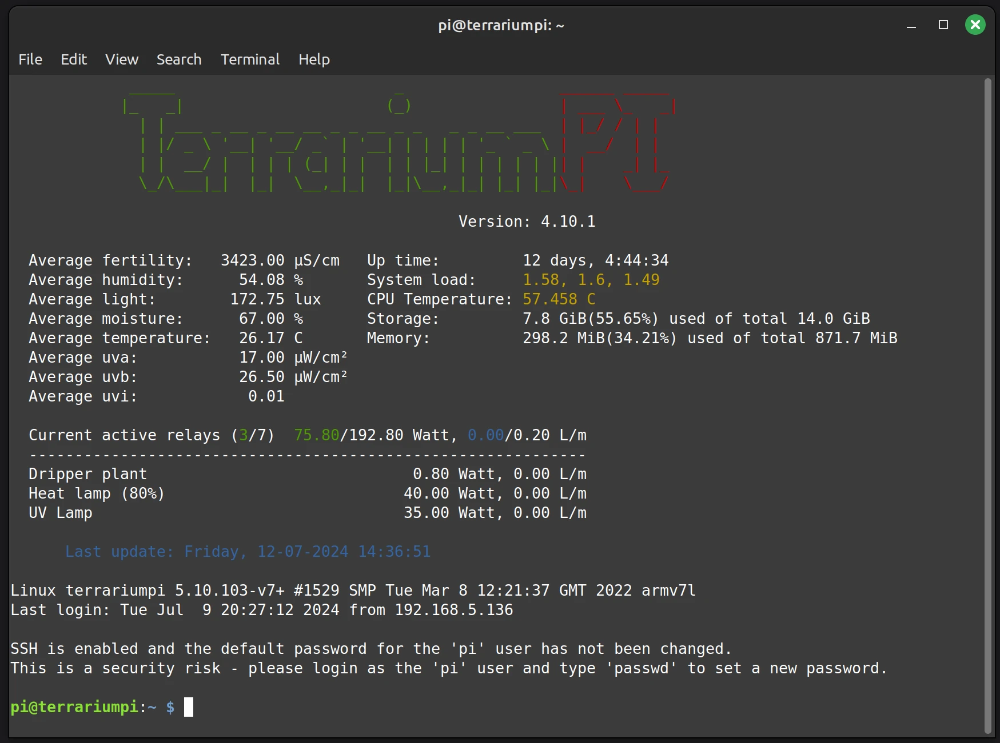

More screenshots can be found [here](https://github.com/theyosh/TerrariumPI/tree/main/screenshots)

## Testing

[Free tested with BrowserStack for open source](https://browserstack.com)

## About

A live version is running at: <https://terrarium.theyosh.nl/index.html>. Go to 'Help' menu for more information about used hardware, software and how to setup.

## License

