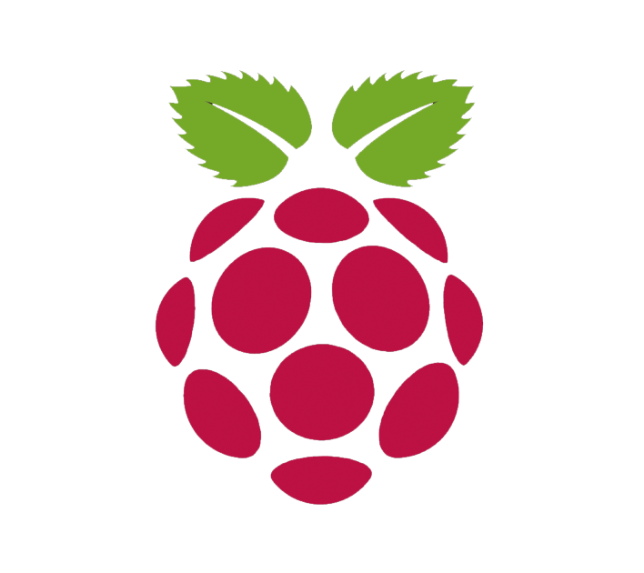

Here we will install Raspberry PI and TerrariumPI software.

Raspberry PI
============
{: .right width="200" }
In order to run TerrariumPI you first need a working Raspberry PI with the '[Raspberry Pi OS Lite](https://www.raspberrypi.org/software/operating-systems/)' image. This is very important, as the Desktop version will not work well with the GPIO pins.

Creating SD Card
----------------
Download and instal the [Raspberry Pi Imager](https://www.raspberrypi.org/software/) to prepare your SD card. Make sure you have a SD card of at least 4GB of size. Bigger is better :)

When the SD card is written, you can read/write the 'boot' partition. Add a file called 'ssh' to it. This will [enable SSH on a headless Raspberry Pi (add file to SD card on another machine)](https://www.raspberrypi.org/documentation/remote-access/ssh/).

Put your SD card in the Pi and power it up.

TerrariumPI
===========
When the Raspberry PI is up and running, you can now install the TerrariumPI software. We assume that you are installing it in the default user (pi) home directory. Run the commands below as normal pi user. This will guide you trough the installation process.

The first time you run the installer, it will also update the Raspberry PI OS to the latest version. This can take some more time.

```console
sudo apt -y install git
git clone --branch 4.x.y.z --depth 1 https://github.com/theyosh/TerrariumPI.git
cd TerrariumPI
sudo ./install.sh
```