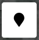

Here you can find how you can setup various parts that works together as a single enclosure. You can even setup multiple enclosures. But make sure that relays and areas are not shared in multiple enclosures or areas.

A simple rule to remember: *A relay can only be used once*.
## Login
{: style="max-height: 100px" .right}
After the installation, you need to setup TerrariumPI. In order to do that, login with a browser at http://[raspberry_pi]:8090 and click on the `Login` link on the left side menu. The default login should be **admin** / **password** ([FAQ]())

## Help
On every form popup you have a small question mark <i class="far fa-question-circle" aria-hidden="true"></i> next to the form title. Click on it to get more information about the form fields.

## Required fields
All fields with a red start (*) are required to fill out. Some fields can be come required based on selected options.

## Settings

_Settings form with four parts_

The settings is split up in multiple parts. Each group contains settings that are related to each other.

### System
In the system group you setup the minimal settings to get TerrariumPI running.

Pi power usage
: Enter the amount of total power in watts used by the Raspberry PI including attached USB devices.

IP number
: Enter the IP to listen for connections. Default 0.0.0.0

Port number
: Enter the port number to listen for connections. Default 8090

Authentication mode
: There are 3 authentication options.
- Full authentication: For all actions you need to be logged in.
- Only for changes: Only adding and updating needs authentication.
- No authentication: No authentication at all. **Be very careful with this!**

User name
:  Enter the user name for authentication. Default admin

New password
:  Enter a new password for authentication. [Encrypted](#admin-password)

Confirm new password
: Confirm the new password for authentication.

Excluded ids
: List of IDs that are excluded. If you mis a sensor or relay, remove it from this list, and it will be used again.

### Locale
In the locale group you can setup your locales that are custom to.

Language
:  Select the interface language. This will also change number and currency formatting.

Temperature type
:  Select the temperature indicator. Only affects the current values.

Distance type
:  Select the distance indicator. Only affects the current values.

Liquid volume type
:  Select the water volume indicator. Only affects the current values.

Wind speed type
:  Select the wind speed indicator. Only affects the current values.

Power price
:  Enter the price per kWh.

Water price
:  Enter the price per L/Gallon.

### Gui
In the Gui group you can tune the web interface.

Title
: Enter a custom title. If it contains the letters PI, it will turn red on the MOTD

Profile image
: Upload a small image. That is used in the left menu.

Graph smoothing
: If the graph is spiky, you can enter a value which is the amount of measurements that are averaged.

Auto dark mode
: Tun dark mode on based on weather sun rise and set

Show min and max values in gauge graphs
: Add the minimum and maximum value that is measured in the last 24 hours on the gauge graph.

Hide enclosures on dashboard
: Only show the average graphs on the dashboard.

All gauges on a single page
: Add an extra menu option to show all the sensors on a single page.

### Cloud
In the cloud group you can enter credentials for different cloud integrations

#### Meross
With the Meross cloud you can use all the relays and sensors that are connected to your account.

Meross username
: The username to login to your Meross cloud account. [Encrypted](#other-sensitive-data)

Meross password
: The password to login to your Meross cloud account. [Encrypted](#other-sensitive-data)

## Weather

_Popup form adding/updating the weather source_

With the weather data you can schedule your light system based on the **sun rise** and **sun set**. This can either be at your home location, or any other location. The sun rise and set times will be shifted to your home location times. So when it is day at 08:00 at the given location, TerrariumPI will thread that as 08:00 local time. This way, you can have seasons with shorter and longer days, based on day of the year.

Other weather data is just for show. Does not have a function.

### Setup
In order to use the weather system, you need to create a free account at [OpenWeatherMap](https://home.openweathermap.org/users/sign_up).

The url format needs to be `https://api.openweathermap.org/data/2.5/weather?q=[City],[Country]&appid=[API_KEY]`. Do not add the `&metric=` part in the url.

## Relays

_Popup form for adding and updating relays - Calibration is only available for dimmers_
Adding and changing relays is done with the above relay form.

Hardware
: The hardware type of the relay. [A full list of supported relays](#relays)

Address
: Enter the address of the relay. This is specific for each [relay](#relays).

Name
: The name of the relay. Use an easy to remember name.

Wattage
: The amount of power that is used when on or at full power (dimmer)

Water flow
: The amount of water that is used when on or at full power (dimmer) in Liter/Gallon per minute

Current
: The current state of the relay. Value 0 is off, 100 is full on, or a value between 0 - 100 (dimmer)

### Calibration
This is only available for dimmers.

Dimmer frequency in Hz
: The frequency of witch the dimmer is working on. The default depends on the selected dimmer type.

Max power in %
: The max power the dimmer is allowed to use. Default 100

Dimmer offset in %
: An offset value that is reduced from the actual value. Default 0
## Sensors

_Popup form adding/updating the sensors_
Adding and changing sensors is done with the above sensor form.

Hardware
: The hardware type of the sensor. [A full list of supported sensors](#sensors)

Type
: Select what kind of sensor it is.

Address
: Enter the address of the sensor. This is specific for each [sensor](#sensors).

Name
: The name of the sensor. Use an easy to remember name.

Alarm min
: The lower alarm value. When the sensor gets below this value, the **low** alarm will be triggered

Alarm max
: The high alarm value. When the sensor gets higher then this value, the **hight** alarm will be triggered

Limit min
: The minimum value that is valid for this sensor. Values measured below this value will be ignored.

Limit max
: The maximum value that is valid for this sensor. Values measured higher then this value will be ignored.

Max diff
: The maximum difference between two measurements that is valid. Enter **0** to disable.

Exclude average
: Exclude this sensor from the average calculation and graphs on the dashboard.

### Calibration
Offset
: Enter a value to correct the output reading. This can be a positive or negative value.

## Doors / buttons

_Popup form for adding and updating buttons - Calibration is only available for light sensors_
Adding and changing buttons is done with the above button form.

Hardware
: The hardware type of the button. [A full list of supported buttons](#buttons)

Address
: Enter the address of the button. This is specific for each [button](#buttons).

Name
: The name of the button. Use an easy to remember name.

Current
: The current state of the button. Value 1 is active, value 0 is not active

### Calibration
This is only available for light sensors.

Capacitor value in µF
: Enter the value of the capacitor

## Webcams

_Popup form for adding and updating webcams_

Adding and changing webcams is done with the above button form.

Hardware
: The hardware type of the webcam. [A full list of supported webcams](#webcams)

Address
: Enter the address of the webcam. This is specific for each [webcam](#webcams).

Name
: The name of the webcam. Use an easy to remember name.

Resolution
: Enter the maximum resolution of the webcam in width x height pixels.

Rotation
: Select the rotation of the webcam.

White balance
: Select the white balance correction option.

Archiving
: Select the archiving type. This can either be motion or timebased.

Archive light state
: Select the state of the lights for making archive images. In order to use this, make sure this webcam is selected at the correct [enclosure](#enclosures)

Archive door state
: Select the state of the doors for making archive images. In order to use this, make sure this webcam is selected at the correct [enclosure](#enclosures)

Flash
: Select relays that act as a flasher. When updating the webcam image, these releays will be toggled on just before taking a picture.

### Motion detection
This is only available when `motion` is selected at **Archiving**.

Show motion boxes
: Show the area where the motion took place.

Motion delta threshold
: How much change is needed in order to detect motion. Default value of 25 works well

Motion minimum area
: The amount of square pixels to look in to detect motion. Default value of 500 works well.

Motion comparison frame
: Select which frame to use for motion detection. Either the latest updated image (last frame), or the latest archived image (when there was motion).

### Markers
It is possible to add markers on the webcam image to show realtime sensor information. Click on the icon in the preview window to drop a marker and select the sensors you want to show.

## Audio

_Popup form for adding and updating playlists_
Adding and changing playlists is done with the above button form.

Name
: The name of the playlist. Use an easy to remember name.

Volume
: The volume of the complete playlist.

Shuffle
: Shuffle the playlist every time it is (re)started.

Repeat
: Repeat the plyalist. If shuffle is enabled, it will be shuffled every repeat action.

Audio files
: List of audio files. The order of adding is order or playing.

## Enclosures

_Popup form for adding and updating enclosures_
Adding and changing enclosures is done with the above button form.

Name
: The name of the enclosure. Use an easy to remember name.

Image
: An image that is used for background image on the dashboard.

Description
: A free field where you can enter some information about your animals/plants. You can even add images here.

Doors
: The door sensors that are used for this enclosure. [Magnetic sensors](#buttons).

Webcams
: One or more webcams that are used in this enclosure. Webcams selected here can use the `archive light state`  and `archive door state` option at the [webcam settings](#webcams).

## Areas
Adding and changing areas is done here. But as areas have a but more functionality, they are discussed per area type. The most important is that there is an area configured as `main lights` as this will influence the timing of other areas if they depend on the timing of the main lights. Without this, the system will not work.

Also make sure that the light area has relays configured at the `Day settings` tab.

Depending on the combination of `Type` and `Mode` some fields are disabled and not used. The values that are shown will be ignored during the operating of the software.

Three fields are always required and shared in all the area types:

Enclosure
: Select the enclosure to which this area belongs.

Type
: Select the type of area. Depending on the type, new/different opions are available.

Name
: The name of the area. Use an easy to remember name.

### Main Lights

_Popup form for adding and updating areas_

Mode
: Select the operating mode of this area. Use timer for custom on and off times. Weather is using your [configured weather data](#weather)

Minimum hours
: Enter the minimum hours that the lights should be on. If the day based on the weather data is shorter, the lights will stay on for at least this amount of time.

Maximum hours
: Enter the maximum hours that the lights should be on. Reverse of minimum hours.

Hours shift
: Shift the time that the lights should go on based on the weather sun rise. Can be a positive or negative decimal value (ex: -1.3)

Main lights
: Toggle this if the lights are the main lights on the enclosure. This is used for other areas that depend on this light area. **Make sure at least one light area has the toggle main lights set**

Then you need to setup at least the `Day settings` tab else the software will not work. Do not use the same relay in the day and night settings. That does not work. A relay configured in the day settings part, will be off during the night period.

In the day and night setting tab you can configure the following:

Begin time
: This is the start time when the relay(s) should go on.

End time
: This is the end time when the relay(s) should go off. The duration between begin and end time call we the `operating window`

On duration
: Here you can finetune the time that the relay(s) should on in **minutes** time. Enter a value of **0** to put the relays on for the complete operating window time.

Off duration
: Enter the amount of **minutes** the relay(s) should be off during the operating window. Enter **0** to disable.

**Timer functionality:** When you have an operating window of 10 hours, and selected 45 min on duration and 15 min off duration, you will get a that the relays will toggle on at the start, run for 45 minutes, and go off for 15 minutes. As this is in total 1 hour, this will be repeated 10 times during the operating window time.

Relays
: Here you select the relay(s) that needs to be controlled. When you select a relay, depending on the type, you will get extra tabs where you can either set the on/off dimming duration or relay delay when the relay(s) are toggled on or off.

**Simulate sun rise/set**: When you select a dimmer and a normal relay, you could setup the dimmer to go on in 30 minutes, and delay the normal relay for 30 minutes, so that when the dimmer is at full power, the other light is toggled on. This will give a nice sun rise effect.

### Other areas

_Popup form for adding and updating areas_
### Audio

### Water tank